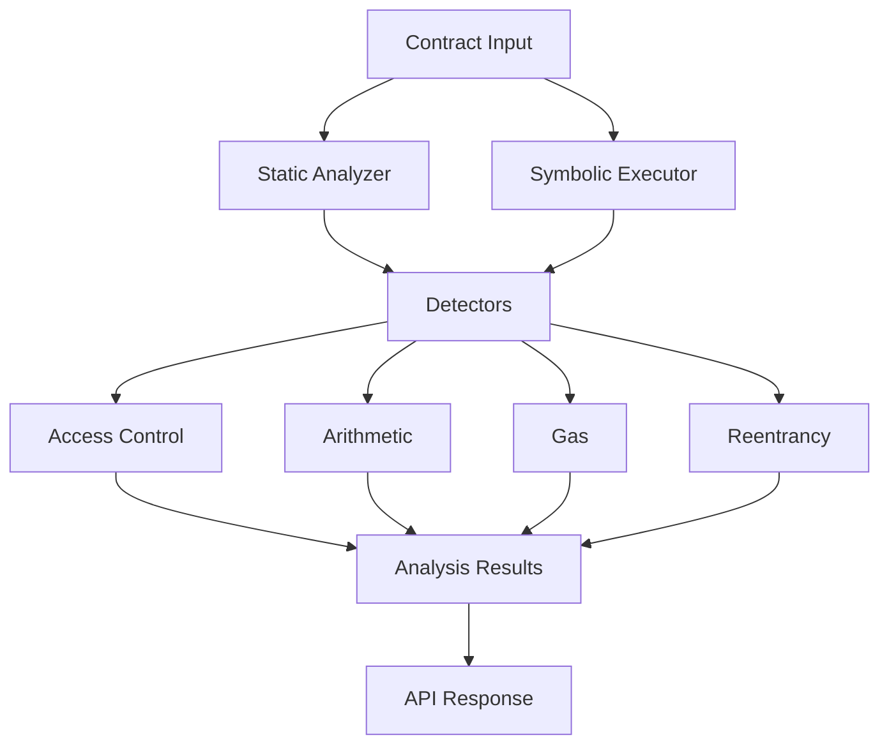
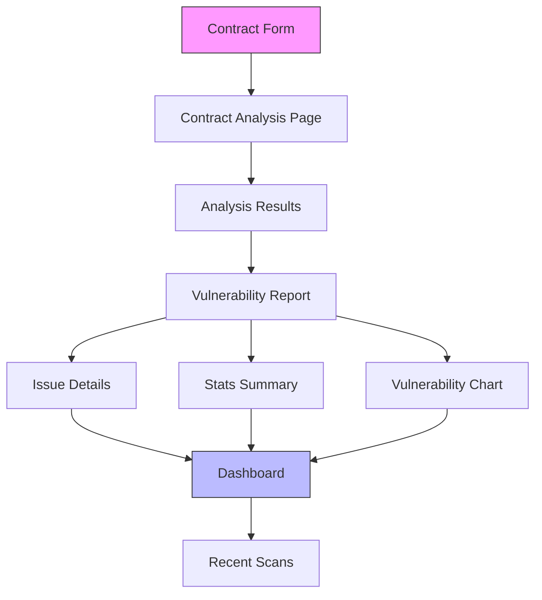

<div align="center">


[](https://my-portfolio-msk9.vercel.app/)
[](https://linkedin.com/in/YOUR_LINKEDIN)
[](https://leetcode.com/YOUR_LEETCODE)
[](mailto:ayush2006kumar996@gmail.com)

[](https://github.com/ayush-roy-21)
[](https://github.com/ayush-roy-21?tab=followers)

</div>

---

## 🧠 About Me

```python
class AyushRoy:
    role       = "Senior Cybersecurity Engineer"
    location   = "Vadodara → Surat, Gujarat, India 🇮🇳"
    education  = "B.Tech Mathematics & Computing @ SVNIT Surat (2024–2028)"
    cgpa       = 7.98 / 10.0

    expertise  = [
        "🔐 Penetration Testing & Vulnerability Assessment (VAPT)",
        "⛓️  Smart Contract Security Auditing (Solidity, Slither, Mythril)",
        "🧬 Malware Analysis, Reverse Engineering & OSINT",
        "📊 ML-Driven Financial Systems & LLM Integration",
        "🌐 Digital Forensics, DeFi Fraud Prevention & Crypto Tracing",
    ]

    flagship   = "https://sc-vulnerability-scanner-12sr.vercel.app/"
    portfolio  = "https://my-portfolio-msk9.vercel.app/"
    currently  = "Building AI-powered threat detection & DeFi security tooling"
    interests  = ["Geopolitics × Cyber Warfare", "Dark Web Monitoring", "AML Systems"]
```

---

## 🎓 Education

| Degree | Institution | Year | Score |
|--------|-------------|------|-------|
| **B.Tech – Mathematics & Computing** | Sardar Vallabhbhai NIT (SVNIT), Surat | 2024 – 2028 | CGPA: **7.98 / 10** |
| **Class XII – Gujarat Board** | Baroda High School, Vadodara | 2022 – 2024 | **85%** |

---

## 🔐 Flagship Project — Smart Contract Vulnerability Scanner

> A comprehensive smart contract security analysis tool combining **static analysis** and **symbolic execution** for thorough security assessment of Ethereum smart contracts.

[](https://sc-vulnerability-scanner-12sr.vercel.app/)
[](https://opensource.org/licenses/MIT)
[](https://reactjs.org/)
[](https://www.typescriptlang.org/)
[](https://python.org/)
[](https://soliditylang.org/)

---

### ✨ Key Features

| Feature | Description |
|---------|-------------|
| 🔬 **Static Analysis** | Slither-like control/data flow analysis and pattern matching |
| 🧮 **Symbolic Execution** | Mythril-like path exploration and constraint solving |
| 🖥️ **Interactive Web UI** | Upload contracts, view reports, get security recommendations |
| 🐛 **Detects** | Reentrancy · Arithmetic Overflow/Underflow · Access Control · Gas Inefficiencies |
| ⚡ **Fast Reports** | Full vulnerability report generated in **< 5 seconds** |
| ✅ **Zero False Negatives** | In controlled test environments across 15+ vulnerability patterns |

---

### 🏗️ System Architecture

```
┌─────────────────┐      ┌─────────────────┐      ┌──────────────────┐
│    Frontend     │      │     Backend     │      │  Smart Contracts │
│    (React)      │◄────►│    (Python)     │◄────►│   (Solidity)     │
├─────────────────┤      ├─────────────────┤      ├──────────────────┤
│ • Contract Form │      │ • Static Anlys  │      │ • AST Analysis   │
│ • Results View  │      │ • Symbolic Exec │      │ • Vuln Patterns  │
│ • Vuln Dashboard│      │ • Detectors     │      │ • Test Cases     │
│                 │      │ • API Endpoints │      │                  │
└────────┬────────┘      └────────┬────────┘      └────────┬─────────┘
         │                        │                         │
         ▼                        ▼                         ▼
┌─────────────────┐      ┌─────────────────┐      ┌──────────────────┐
│ External Svcs   │      │    Database     │      │   Blockchain     │
├─────────────────┤      ├─────────────────┤      ├──────────────────┤
│ • Code Repos    │      │ • Scan History  │      │ • Mainnet        │
│ • Docs          │      │ • Vulns Store   │      │ • Testnet        │
│ • Updates       │      │ • Analytics     │      │ • Local Node     │
└─────────────────┘      └─────────────────┘      └──────────────────┘
```

---

### 🔄 Analysis Flow

**Backend Pipeline:**



**Frontend Pipeline:**



---

### 🛠️ Tech Stack

| Layer | Technology |
|-------|-----------|
| **Frontend** | React · TypeScript |
| **Backend** | Python · Flask / FastAPI |
| **Analysis Engines** | Static Analyzer · Symbolic Executor · AST Parser |
| **Vulnerability Detectors** | Reentrancy · Arithmetic · Access Control · Gas |
| **Target Contracts** | Solidity (Ethereum) |
| **Deployment** | Vercel |

---

### 📁 Project Structure

```
sc-vulnerability-scanner/
├── backend/
│   ├── analyzers/
│   │   ├── ast_parser.py           # Solidity AST parsing
│   │   ├── static_analyzer.py      # Static analysis engine
│   │   └── symbolic_executor.py    # Symbolic execution engine
│   ├── detectors/
│   │   ├── access_control_detector.py
│   │   ├── arithmetic_detector.py
│   │   ├── gas_detector.py
│   │   └── reentrancy_detector.py
│   ├── tests/
│   │   └── contracts/              # Test Solidity contracts
│   ├── app.py                      # Main Flask/FastAPI app
│   └── requirements.txt
├── frontend/
│   ├── src/
│   │   ├── components/             # Reusable UI components
│   │   ├── pages/                  # Application pages
│   │   ├── theme/                  # UI theme config
│   │   └── utils/                  # Helper utilities
│   ├── package.json
│   └── tsconfig.json
└── scripts/                        # Utility scripts
```

---

### ⚙️ Quick Start

```bash
# 1. Clone the repo
git clone https://github.com/ayush-roy-21/sc-vulnerability-scanner.git

# 2. Backend setup
cd backend
python -m venv venv
source venv/bin/activate        # Windows: venv\Scripts\activate
pip install -r requirements.txt
python app.py                   # Starts on http://localhost:5000

# 3. Frontend setup (new terminal)
cd frontend
npm install
npm start                       # Starts on http://localhost:3000

# 4. Scan a contract via CLI
curl -X POST -F "file=@MyContract.sol" http://localhost:5000/analyze
```

---

### 🐛 Supported Vulnerability Types

```
⚠️  Reentrancy Attacks          →  Cross-function and cross-contract reentrancy
🔢  Arithmetic Overflow          →  Integer overflow / underflow in Solidity <0.8
🔑  Access Control Issues        →  Unprotected functions, tx.origin misuse
⛽  Gas Inefficiencies           →  Unbounded loops, expensive storage patterns
```

---

## 🛡️ Technical Arsenal

<details>
<summary><b>🔐 Cybersecurity & Offensive Security</b></summary>
<br>

- **VAPT** — Penetration Testing & Vulnerability Assessment using industry-standard methodologies
- **Network Security** — Traffic Analysis via Wireshark, Tcpdump, ARP Spoofing Detection
- **Web App Security** — OWASP Top 10 Testing & Patching
- **Malware Analysis** — Reverse Engineering, Static/Dynamic Analysis & Threat Intelligence
- **OSINT** — Open-Source Intelligence gathering & Dark Web Monitoring

</details>

<details>
<summary><b>⛓️ Blockchain & Smart Contract Security</b></summary>
<br>

- **Solidity** Smart Contract Development (Ethereum, Binance Smart Chain, Polygon)
- **Security Auditing** — Reentrancy, Integer Overflow, Gas Optimization via Slither & Mythril
- **Crypto Forensics** — Transaction Tracing, Wallet Clustering & Fraud Detection
- **DeFi Security** — Multi-Sig Wallets, Trustless Escrow, AML Dashboard Design

</details>

<details>
<summary><b>💻 Languages</b></summary>
<br>


</details>

<details>
<summary><b>🧰 Frameworks, Tools & Security Stack</b></summary>
<br>

**Web & Frontend:**


**Security Tools:**


**DevOps & Infra:**


</details>

---

## 🚀 Other Projects

### 📈 EigenTrade — Automated ML Trading System
> `Python` · `Machine Learning` · `PL/SQL` · `LLM Integration`

| Metric | Result |
|--------|--------|
| 🎯 Prediction Accuracy | **50–55%** on historical stock data |
| ⚡ LLM Explainer Latency | Reduced to **2 seconds** per trade |
| 🗄️ Data Retrieval Speed | **40% faster** via advanced PL/SQL tuning |
| 📊 Records Processed | **10–20 million** historical records |

---

### 🎣 Phishing Threat Detection & Analysis System
> `Python` · `Laravel` · `Browser Extension`

| Metric | Result |
|--------|--------|
| ⚡ URL Analysis Speed | **50ms** per URL — pre-page-load blocking |
| 🪤 Honeypot Neutralization | **20–30%** of active threats isolated |
| 📬 Response Automation | Auto-reporting to authorities via scraping bots |

---

### 🌐 Decentralized Remittance Platform
> `Solidity` · `React.js` · `Web3.js`

| Metric | Result |
|--------|--------|
| 💸 Fee Reduction | **90%** vs traditional cross-border banking |
| ⏳ Settlement Time | **< 1 minute** vs days with SWIFT |
| 🔐 Fund Security | **100%** secured via Multi-Sig + Escrow |
| 🔎 AML Dashboard | Real-time suspicious wallet cluster flagging |

---

## 📊 GitHub Stats

<div align="center">


</div>

<div align="center">

[](https://git.io/streak-stats)

</div>

---

## 🏆 GitHub Trophies

<div align="center">

[](https://github.com/ryo-ma/github-profile-trophy)

</div>

---

## 🎯 Areas of Deep Interest

```
🔬  Digital Forensics & Investigation  →  Cyber Crime, Malware Analysis, Reverse Engineering
⛓️   Blockchain Security               →  Smart Contract Auditing, DeFi Fraud, Crypto Tracing
🌍  Threat Intelligence                →  OSINT, Dark Web Monitoring, APT Tracking
💳  Financial Security                 →  Online Fraud Detection, Secure Payment Architectures
🌐  Geopolitics × Cyber Warfare        →  International Relations & State-Sponsored Cyber Ops
```

---

## 🌐 Languages

| Language | Level |
|----------|-------|
| 🇬🇧 English | Professional Proficiency (C1) |
| 🇮🇳 Hindi | Native |
| 🇮🇳 Gujarati | Fluent |

---

## 🤝 Leadership & Volunteering

**🎭 Surat Literature Festival (LitFest) — Event Volunteer** · *Surat, Gujarat · 2026*

> Managed on-ground logistics, guest relations, and crowd control for major sessions, ensuring seamless event execution.

---

## 📫 Let's Connect

<div align="center">

Working on **smart contract security**, **DeFi**, **blockchain forensics**, or **ML-driven threat intelligence**? Let's collaborate.

[](https://sc-vulnerability-scanner-12sr.vercel.app/)
[](https://my-portfolio-msk9.vercel.app/)
[](https://linkedin.com/in/YOUR_LINKEDIN)
[](mailto:ayush2006kumar996@gmail.com)

</div>

---

<div align="center">


*"Security is not a product, but a process."* — Bruce Schneier

</div>
